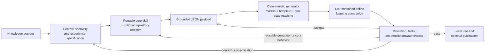

# Learning Companions Architecture

## What a learning companion is

A learning companion is a small, grounded interactive layer that complements a
lecture, textbook, knowledge base, or practical. It helps a learner move through
a short loop:

1. explanation;
2. exploration;
3. knowledge check; and
4. corrective feedback.

The companion is grounded because its explanations, examples, questions, and
feedback come from named knowledge sources. It can make those sources easier to
practise, but it does not invent an additional body of course knowledge.

A learning companion is not a learning management system, chatbot, replacement
textbook, grading system, or source of new unsupported knowledge. It is a
focused learning aid that remains subordinate to its source material.

## Architectural layers

The architecture separates reusable learning behavior from repository-specific
policy and lecture-specific content. It has eight layers, in this order:

1. **Knowledge layer.** Repository instructions, lectures, notebooks,
   documentation, OKF concepts, or another knowledge base supply the
   authoritative subject matter and provenance.
2. **Context layer.** Context discovery identifies the learner, learning goals,
   named sources, excluded material, accessibility needs, repository
   conventions, output location, and acceptance checks. These decisions form a
   short experience specification.
3. **Skill layer.** The portable
   `interactive-learning-experience-builder` owns the general workflow and can
   be paired with an optional thin repository adapter for stable local rules.
4. **Content layer.** A grounded JSON payload expresses the experience
   specification as concepts, explanations, semantic visualization payloads,
   controls, quiz content, feedback, and provenance.
5. **Runtime layer.** A deterministic generator combines the payload with pure
   visualization model calculations, the HTML template, quiz state machine,
   accessibility behavior, and static fallbacks.
6. **Artifact layer.** Generation produces one self-contained HTML learning
   companion that opens through `file://` without an account, server, CDN,
   external font, or runtime network dependency.
7. **Assurance layer.** Validation, executable tests, repository policy checks,
   deterministic-regeneration checks, and mobile browser checks establish that
   the artifact meets its content, accessibility, safety, and portability
   contracts.
8. **Delivery layer.** A verified artifact can be used locally as the committed
   offline companion and, where a repository supports it, copied into an
   optional static-site publication.



The correction edges are deliberate. Assurance defects in context or the
experience specification return to context discovery; grounded-content defects
return to the payload; and reusable generator or core-behavior defects return
to the portable-core or adapter layer. Generated artifacts are regenerated,
never hand-edited.

## Responsibility boundaries

Each component has one kind of responsibility. Keeping these boundaries clear
prevents course policy from leaking into the portable core and prevents
generated artifacts from becoming a second application codebase.

| Component | Owns | Must not own |
|---|---|---|
| Portable core skill | General workflow, content contract, generator, template, quiz state machine, accessibility, offline validation | ML-course paths, OKF rules, private/public course policy, a particular publishing platform |
| Repository adapter | Stable local source hierarchy, safety allowlist, paths, recurring checks, publishing convention | A copied generator, template, quiz engine, or portable accessibility rules |
| Experience specification and payload | Learner, goals, grounded explanations, controls, quiz content, provenance | Executable application logic or private sources |
| Generated companion | Embedded content and runtime needed by the learner | External dependencies, accounts, uploads, arbitrary execution, or hidden knowledge sources |
| Repository build and CI | Regression checks and optional publication | A second hand-maintained companion source |

The portable core remains domain-neutral. A repository adapter narrows and
connects it to one repository without forking the generator or its learning
runtime. The experience specification and payload vary by audience and topic;
the generated companion is their reproducible, learner-facing result.
A repository adapter owns only stable local rules.

### Semantic visualization boundary

Topic meaning crosses the runtime boundary explicitly:

```text
semantic payload
→ Python schema validation
→ embedded visualization-models.js calculations
→ template-owned SVG and DOM
→ live summary and static fallback
```

Each semantic visualization payload carries the labels and values needed for
its learning objective. The Python generator validates that schema and embeds
`assets/visualization-models.js`. A pure visualization model calculates
threshold counts, class assignments, residuals, coefficient paths, or error
metrics without touching the DOM. The template alone owns SVG and DOM
rendering, live summaries, palette presentation, and the matching readable
fallback. This division makes the calculations executable in Node tests while
keeping the generated artifact self-contained.

## Portability model

There are two supported adoption paths:

- **One-off core path.** Discover the local context, record an experience
  specification, create the grounded payload, and use the portable core
  directly.
- **Recurring-adapter path.** When the same source hierarchy, safety allowlist,
  paths, checks, and delivery convention recur across experiences, add a thin
  repository adapter that records only those stable local rules.

Do not create one skill per lecture or topic. A lecture or topic receives its
own experience specification and grounded JSON payload. A repository adapter
is justified only by recurring repository-level policy.

The core also supports repositories without `AGENTS.md`, build tooling, or
publishing configuration. In those settings, the context can be established
from an agreed knowledge root and stable repository paths, URLs, or
knowledge-base identifiers. The resulting self-contained artifact can remain a
local file; publication is optional rather than an architectural prerequisite.

## ML-course mapping

The ML course is one concrete mapping of the portable architecture:

- `lectures/` is the primary knowledge layer for full explanations and
  provenance.
- `okf/` provides durable concept metadata and relationships as read-only
  support for standalone companion generation.
- The course source allowlist restricts a companion to canonical public sources
  for its selected lecture and permitted `okf/` material.
- `lecture_experiences/content/<lecture_slug>.json` is the grounded JSON
  payload for that lecture, including any semantic visualization payload.
- `.agents/skills/interactive-learning-experience-builder/assets/visualization-models.js`
  contains the portable, pure visualization model calculations used by every
  generated companion.
- `lecture_experiences/<lecture_slug>/index.html` is the canonical offline
  HTML artifact.
- The preview build derives
  `site/_build/demos/<lecture_slug>/index.html` from that canonical artifact
  for Pages.
- The public student repository is the publishing boundary for the student
  companion.

The teacher repository is mentioned here only to make the safety boundary
explicit: private sources must never cross into the shared architecture,
public payload, generated companion, or student repository. This boundary does
not make teacher-repository policy part of the portable core.

## How to use the architecture

**Learners** open a companion online or through `file://`, choose the available
question depth and accessibility preferences, explore the grounded
explanations and visualizations, and use corrective quiz feedback for practice.

**Maintainers** choose authoritative sources, define the learner and goals in
an experience specification, author the payload, use the appropriate core or
repository-adapter path, inspect the generated artifact, and require assurance
to pass before delivery.

**AI agents** first read repository instructions and source boundaries, invoke
the portable core and any applicable repository adapter, name every source,
preserve public/private separation, regenerate deterministically, and report
validation evidence rather than assuming success.

**Unrelated repositories** start with the portable core for a one-off
experience. They add a repository adapter only after stable local discovery,
safety, path, or publication rules recur.

For exact generation, validation, preview, and publishing commands in this
repository, use the
[interactive lecture learning assistant operational guide](interactive-lecture-learning-assistant.md).

## Assurance and safety

Every explanation, visualization, question, and item of feedback needs named
provenance. Private sources are excluded at context discovery. They must remain
absent from specifications, payloads, artifacts, and publication.

The learner experience must remain usable when interactive enhancement is
unavailable. Static fallbacks preserve meaning, keyboard operation and visible
focus preserve navigation, and color-blind support uses redundant non-color
cues. Reduced-motion preferences must be respected. Mobile Chrome checks
confirm that controls, feedback, progress, and reading layout remain usable on
a small viewport.

The self-contained artifact must have no runtime network dependencies. Its
regeneration is deterministic: the same approved inputs and generator produce
the same output. Offline validation checks the artifact contract, while
executable quiz tests check the state machine and corrective-feedback behavior.
Repository checks enforce source and output policy, including the public
student-repository publishing boundary, before a companion is delivered.

## Maintenance rules

Change the **portable core** when a general content contract, generator,
template, quiz-state, accessibility, or offline-validation behavior should
apply to learning companions in any repository.

Change a **repository adapter** when a stable local source hierarchy, safety
allowlist, path, recurring verification check, or publication convention
changes. Do not copy portable implementation into the adapter.

Change only the **experience specification and payload** when the learner,
goals, grounded explanation, controls, visualization, quiz content, feedback,
or provenance changes for one experience. Content-only changes do not justify
a new core skill or adapter.

Regenerate the **artifact** after an approved core, adapter, specification, or
payload change affects its output. In the ML course, the committed offline HTML
under `lecture_experiences/<lecture_slug>/index.html` is canonical. Output
under `site/_build/` is derived and must not become a second hand-maintained
companion source.
