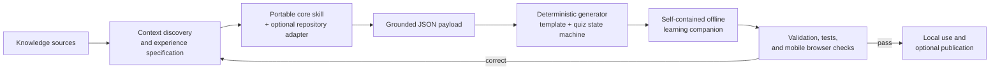

# Learning Companions Architecture Documentation Implementation Plan

> **For agentic workers:** REQUIRED SUB-SKILL: Use superpowers:subagent-driven-development (recommended) or superpowers:executing-plans to implement this plan task-by-task. Steps use checkbox (`- [ ]`) syntax for tracking.

**Goal:** Add one shared high-level architecture guide for learning companions and connect it to the operational documentation in both the student and teacher repositories.

**Architecture:** The shared `docs/learning-companions-architecture.md` is the conceptual reference; the existing `docs/interactive-lecture-learning-assistant.md` remains the operational command guide. Student changes are authored once, tested, committed, and then applied unchanged to a teacher integration branch so the shared documentation cannot drift.

**Tech Stack:** Markdown, Mermaid, Python 3.13, pytest, Ruff, Git worktrees.

## Global Constraints

- The primary audience is maintainers and AI agents, with a short student-facing introduction.
- The architecture document must be identical in both repositories.
- The portable core must remain domain-neutral and must not absorb ML-course, OKF, private/public, or publishing-platform rules.
- The ML-course adapter owns only stable course discovery, source safety, paths, recurring checks, and publishing conventions.
- A topic or lecture receives an experience specification and payload, not a new skill.
- No runtime, payload, quiz, template, or publishing behavior changes.
- No teacher-only paths or private source details may enter the student repository.
- `docs/interactive-lecture-learning-assistant.md` remains the operational guide.
- Preserve the untracked `catboost_info/` and `quizzes/` directories in the main student checkout.

---

### Task 1: Add the canonical architecture reference

**Files:**
- Create: `docs/learning-companions-architecture.md`
- Modify: `tests/test_interactive_learning_assistant_docs.py`

**Interfaces:**
- Consumes: the approved design in `docs/superpowers/specs/2026-07-19-learning-companions-architecture-documentation-design.md`.
- Produces: a conceptual architecture reference at `docs/learning-companions-architecture.md` with stable headings and terminology used by navigation tests.

- [ ] **Step 1: Write the failing architecture-contract test**

Add these constants and test to
`tests/test_interactive_learning_assistant_docs.py`:

```python
ARCHITECTURE_PATH = "docs/learning-companions-architecture.md"


def test_learning_companions_architecture_contract() -> None:
    path = Path(ARCHITECTURE_PATH)
    assert path.is_file()

    text = path.read_text(encoding="utf-8")
    for heading in (
        "# Learning Companions Architecture",
        "## What a learning companion is",
        "## Architectural layers",
        "## Responsibility boundaries",
        "## Portability model",
        "## ML-course mapping",
        "## How to use the architecture",
        "## Assurance and safety",
        "## Maintenance rules",
    ):
        assert heading in text

    for term in (
        "interactive-learning-experience-builder",
        "repository adapter",
        "experience specification",
        "grounded JSON payload",
        "deterministic",
        "self-contained",
        "file://",
        "validation",
        "student repository",
        "teacher repository",
    ):
        assert term in text

    assert "```mermaid" in text
    assert "flowchart LR" in text
    assert "| Portable core skill |" in text
    assert "one skill per lecture" in text
```

- [ ] **Step 2: Run the test and verify the red state**

Run:

```powershell
python -m pytest tests/test_interactive_learning_assistant_docs.py::test_learning_companions_architecture_contract -q
```

Expected: FAIL because `docs/learning-companions-architecture.md` does not
exist.

- [ ] **Step 3: Write the architecture document**

Create `docs/learning-companions-architecture.md` with this exact information
architecture:

````markdown
# Learning Companions Architecture

## What a learning companion is

Define a companion as a small, grounded interactive layer that complements a
lecture, textbook, knowledge base, or practical. Explain the learning loop:
explanation → exploration → knowledge check → corrective feedback. State that
it is not an LMS, chatbot, replacement textbook, grading system, or source of
new unsupported knowledge.

## Architectural layers

Describe knowledge, context, skill, content, runtime, artifact, assurance, and
delivery layers in that order.



Explain that the correction edge protects provenance, accessibility, safety,
and deterministic output before publication.

## Responsibility boundaries

| Component | Owns | Must not own |
|---|---|---|
| Portable core skill | General workflow, content contract, generator, template, quiz state machine, accessibility, offline validation | ML-course paths, OKF rules, private/public course policy, a particular publishing platform |
| Repository adapter | Stable local source hierarchy, safety allowlist, paths, recurring checks, publishing convention | A copied generator, template, quiz engine, or portable accessibility rules |
| Experience specification and payload | Learner, goals, grounded explanations, controls, quiz content, provenance | Executable application logic or private sources |
| Generated companion | Embedded content and runtime needed by the learner | External dependencies, accounts, uploads, arbitrary execution, or hidden knowledge sources |
| Repository build and CI | Regression checks and optional publication | A second hand-maintained companion source |

## Portability model

Document the one-off core path and recurring-adapter path. State explicitly:
"Do not create one skill per lecture or topic." Explain support for repositories
without AGENTS.md, build tooling, or publishing configuration.

## ML-course mapping

Map lectures/, read-only OKF support, the course source allowlist,
lecture_experiences/content/<lecture_slug>.json, the canonical offline HTML,
the site/_build Pages copy, and the public student publishing boundary. Mention
the teacher repository only as a safety boundary; do not identify private
source content.

## How to use the architecture

Provide short paths for Learners, Maintainers, AI agents, and Unrelated
repositories. Link the operational guide for exact commands.

## Assurance and safety

Cover named provenance, no private sources, static fallbacks, keyboard/focus
behavior, color-blind support, reduced motion, mobile Chrome, no runtime
network dependencies, deterministic regeneration, executable quiz tests, and
public-repository publishing checks.

## Maintenance rules

Explain when to change the portable core, change a repository adapter, change
only an experience specification/payload, and regenerate an artifact. State
that the committed offline HTML is canonical and build output is derived.
````

Write complete prose under every heading. Keep the document architectural:
link to `docs/interactive-lecture-learning-assistant.md` instead of duplicating
generation commands.

- [ ] **Step 4: Run the focused test**

Run:

```powershell
python -m pytest tests/test_interactive_learning_assistant_docs.py::test_learning_companions_architecture_contract -q
```

Expected: PASS.

- [ ] **Step 5: Commit the canonical reference**

```powershell
git add docs/learning-companions-architecture.md tests/test_interactive_learning_assistant_docs.py
git commit -m "docs: explain learning companions architecture"
```

### Task 2: Connect repository navigation and usage documentation

**Files:**
- Modify: `README.md`
- Modify: `AGENTS.md`
- Modify: `docs/interactive-lecture-learning-assistant.md`
- Modify: `docs/contributing-to-textbook.md`
- Modify: `tests/test_interactive_learning_assistant_docs.py`

**Interfaces:**
- Consumes: `docs/learning-companions-architecture.md` from Task 1.
- Produces: discoverable conceptual and operational documentation paths for students, maintainers, and agents.

- [ ] **Step 1: Write the failing navigation test**

Add:

```python
def test_learning_companions_architecture_is_linked_from_repository_guides() -> None:
    architecture_path = "docs/learning-companions-architecture.md"
    documents = {
        "README.md": Path("README.md").read_text(encoding="utf-8"),
        "AGENTS.md": Path("AGENTS.md").read_text(encoding="utf-8"),
        "docs/interactive-lecture-learning-assistant.md": Path(
            "docs/interactive-lecture-learning-assistant.md"
        ).read_text(encoding="utf-8"),
        "docs/contributing-to-textbook.md": Path(
            "docs/contributing-to-textbook.md"
        ).read_text(encoding="utf-8"),
    }

    assert architecture_path in documents["README.md"]
    assert architecture_path in documents["AGENTS.md"]
    assert "learning-companions-architecture.md" in documents[
        "docs/interactive-lecture-learning-assistant.md"
    ]
    assert "learning-companions-architecture.md" in documents[
        "docs/contributing-to-textbook.md"
    ]
    assert "operational guide" in documents[
        "docs/interactive-lecture-learning-assistant.md"
    ].lower()
    assert "complement" in documents["docs/contributing-to-textbook.md"].lower()
```

- [ ] **Step 2: Run the navigation test and verify the red state**

Run:

```powershell
python -m pytest tests/test_interactive_learning_assistant_docs.py::test_learning_companions_architecture_is_linked_from_repository_guides -q
```

Expected: FAIL because the four documents do not yet link the architecture
reference.

- [ ] **Step 3: Update README navigation**

In `README.md`, under `### Interactive lecture reviews`, add:

```markdown
- [Learning companions architecture](docs/learning-companions-architecture.md)
- [Operational generation and publishing guide](docs/interactive-lecture-learning-assistant.md)
```

Replace wording that calls the existing guide simply the
"Learning-assistant guide" so readers can distinguish the conceptual and
operational documents.

- [ ] **Step 4: Update AGENTS navigation**

In the ordered list under `To create or revise an interactive lecture review`,
insert:

```markdown
1. `docs/learning-companions-architecture.md` — conceptual layers, ownership boundaries, portability model, and lifecycle
2. `.agents/skills/interactive-learning-experience-builder/SKILL.md` — portable content contract, deterministic generator, and offline validator
3. `.agents/skills/ml-course-interactive-learning-assistant/SKILL.md` — ML-course source, safety, output, and publishing adapter
```

Renumber the remaining entries. Add the architecture document to the
`Supporting Directories` or documentation list if that list names the
operational guide.

- [ ] **Step 5: Label and link the operational guide**

Immediately after the title in
`docs/interactive-lecture-learning-assistant.md`, add:

```markdown
This is the operational guide for generating, validating, and publishing an
ML-course learning companion. For the conceptual model, component boundaries,
and portability strategy, read
[Learning Companions Architecture](learning-companions-architecture.md).
```

Keep the existing generation, retry, publication, and public-safety commands
unchanged.

- [ ] **Step 6: Connect the textbook contribution guide**

After the `## Interactive labs` section in
`docs/contributing-to-textbook.md`, add:

```markdown
## Learning companions

Standalone learning companions complement the durable concepts and
relationships in `okf/`. They combine grounded explanations, focused
interactive views, accessibility controls, and corrective quizzes in one
self-contained HTML artifact.

Read [Learning Companions Architecture](learning-companions-architecture.md)
for the high-level model and
[Interactive Lecture Learning Assistant](interactive-lecture-learning-assistant.md)
for the ML-course generation workflow. Keep durable pedagogy in `okf/`; keep
companion payloads and generated offline artifacts under
`lecture_experiences/`.
```

- [ ] **Step 7: Run focused documentation tests**

Run:

```powershell
python -m pytest tests/test_interactive_learning_assistant_docs.py -q
```

Expected: all tests in the file PASS.

- [ ] **Step 8: Commit navigation updates**

```powershell
git add README.md AGENTS.md docs/interactive-lecture-learning-assistant.md docs/contributing-to-textbook.md tests/test_interactive_learning_assistant_docs.py
git commit -m "docs: connect learning companion usage guides"
```

### Task 3: Verify and integrate the shared documentation into both repositories

**Files:**
- Verify shared files from Tasks 1 and 2.
- Apply the shared commits to a teacher integration branch.

**Interfaces:**
- Consumes: the two student documentation commits.
- Produces: byte-identical shared architecture and usage documentation in student and teacher repository main branches.

- [ ] **Step 1: Run fresh student verification**

Run:

```powershell
$env:NODE_BINARY='C:\Users\AndrD\.cache\codex-runtimes\codex-primary-runtime\dependencies\node\bin\node.exe'
python -m pytest -q
$env:PYTHONPATH='src'
python tools/validate_okf.py okf/ --strict-warnings
python tools/build_textbook_preview.py
```

Expected: pytest passes, OKF reports 0 errors and 0 warnings, and the preview
build exits 0.

Run the exact CI Ruff set from
`.github/workflows/validate-okf.yml` with:

```powershell
$ruff='C:\projects\personal\ml-course\.venv\Scripts\ruff.exe'
$targets=@(
  'src/mlcourse/okf_validation.py',
  'tools/validate_okf.py',
  'tools/build_textbook_preview.py',
  '.agents/skills/interactive-learning-experience-builder/scripts/generate_learning_experience.py',
  '.agents/skills/interactive-learning-experience-builder/scripts/validate_learning_experience.py',
  '.agents/skills/ml-course-interactive-learning-assistant/scripts/generate_course_learning_experience.py',
  'tests/test_okf_validation.py',
  'tests/test_textbook_preview.py',
  'tests/test_textbook_contribution_skill.py',
  'tests/test_interactive_learning_assistant_docs.py',
  'tests/test_interactive_learning_assistant_skill.py',
  'tests/test_interactive_learning_experience_builder_skill.py',
  'tests/test_learning_experience_portability.py',
  'tests/test_lecture_site_generator.py',
  'tests/test_eda_lecture_experience.py'
)
& $ruff format --check @targets
& $ruff check @targets
```

Expected: all files formatted and lint clean.

- [ ] **Step 2: Create a teacher integration branch**

In `C:\projects\personal\ml-course-public-sync`:

```powershell
git fetch origin main
git switch main
git merge --ff-only origin/main
git switch -c codex/teacher-learning-companions-documentation
```

Expected: the branch starts at the current teacher `origin/main` and the
teacher worktree is clean.

- [ ] **Step 3: Apply the shared documentation commits**

```powershell
$studentBranch='codex/learning-companions-documentation'
$task1=git log $studentBranch --format='%H' --grep='^docs: explain learning companions architecture$' -1
$task2=git log $studentBranch --format='%H' --grep='^docs: connect learning companion usage guides$' -1
if (-not $task1 -or -not $task2) {
  throw 'Required shared documentation commits were not found.'
}
git cherry-pick $task1 $task2
```

If `AGENTS.md` or `README.md` conflicts, preserve teacher-only sections and
apply the shared learning-companion links without copying teacher-only text into
student files. Continue only after `git diff --check` passes.

- [ ] **Step 4: Prove shared-document parity**

Compare SHA-256 hashes for:

```text
docs/learning-companions-architecture.md
docs/interactive-lecture-learning-assistant.md
docs/contributing-to-textbook.md
tests/test_interactive_learning_assistant_docs.py
```

Expected: all four files are byte-identical between the student and teacher
integration worktrees. `README.md` and `AGENTS.md` may differ outside the
shared learning-companion sections.

- [ ] **Step 5: Run fresh teacher verification**

Use the same Ruff, pytest, strict OKF, and preview-build commands as Step 1 in
`C:\projects\personal\ml-course-public-sync`.

Expected: every command exits 0.

- [ ] **Step 6: Request whole-change review**

Generate a review package from each repository main base to its integration
HEAD. Review:

- architecture accuracy and clarity;
- core/adapter responsibility boundaries;
- student/teacher safety language;
- navigation completeness;
- shared-file parity;
- absence of runtime behavior changes.

Resolve every Critical or Important finding, rerun covering tests, and request
re-review before integration.

- [ ] **Step 7: Integrate the approved branches**

After review and fresh verification:

```powershell
git push upstream HEAD:main
git -C 'C:\projects\personal\ml-course-public-sync' push origin HEAD:main
```

Expected: both non-force pushes succeed.

- [ ] **Step 8: Verify remote checks**

Confirm the latest `Build Textbook Preview` and `Validate OKF` runs succeed for
both new main SHAs. Confirm the published student textbook and EDA companion
remain HTTP 200.
